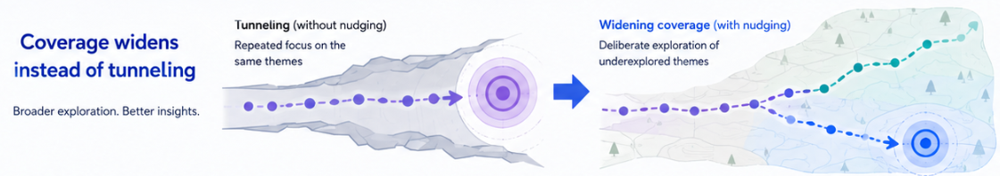
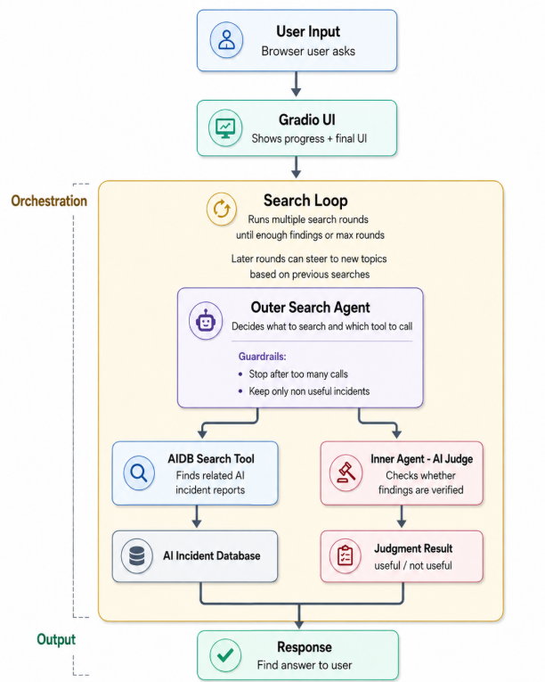
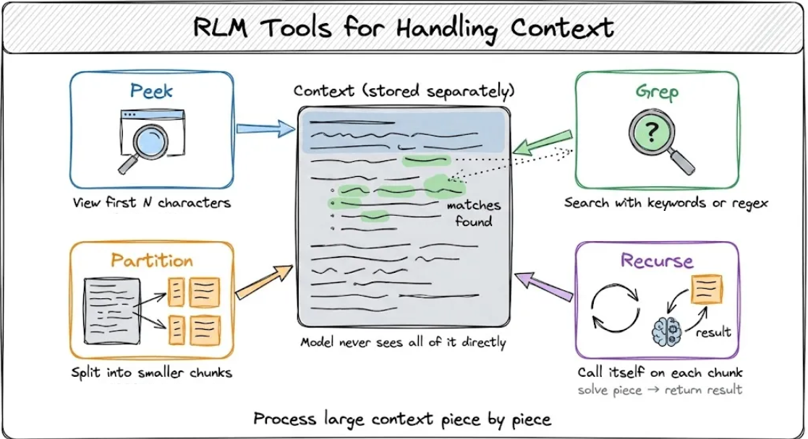
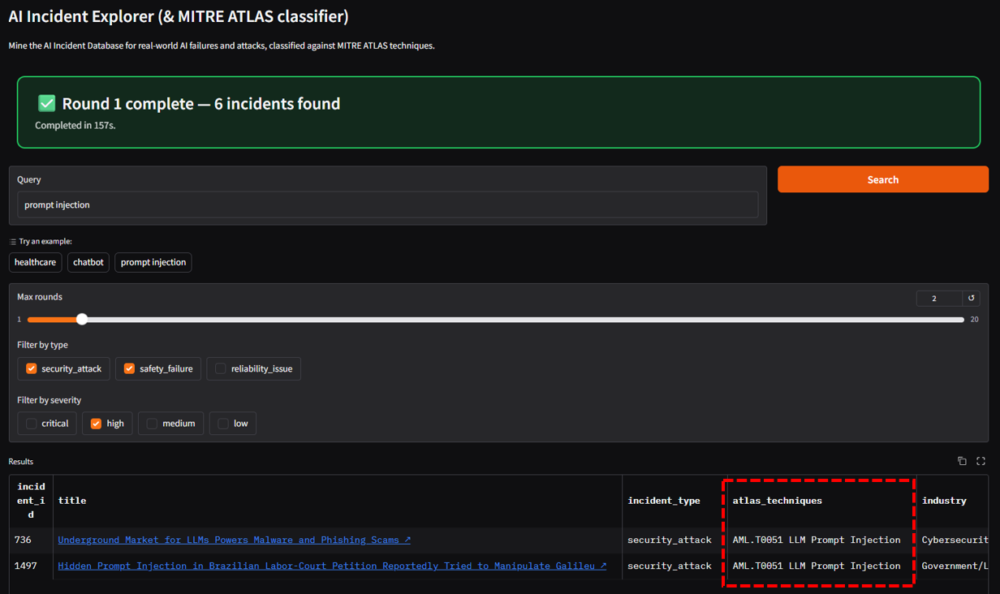

# AI Incident Explorer

> An autonomous agentic tool that mines the [AI Incident Database (AIID)](https://incidentdatabase.ai) to surface, classify, and triage real-world AI failures and attacks — mapping each one to **MITRE ATLAS** adversarial-ML techniques via an **LLM-as-a-Judge** classifier, with **agent observability**.

---

## Why This Project Exists

**Agents operating over long horizons can degrade in two predictable ways**: Long‑horizon agents can experience **context rot**, and those engaged in long agentic search may additionally drift into **query narrowing** .

**This project is a demonstration of how both can be addressed — context rot with a [Recursive Language Model (RLM)](https://arxiv.org/html/2512.24601v3) architecture, and query narrowing with [LDA](https://www.ibm.com/think/topics/topic-modeling)-based topic steering** — using **AI Incident Explorer** as the use case.

> **What's an RLM?** A *Recursive Language Model* keeps the agent's working state in a sandboxed Python REPL instead of stuffing every tool result back into the prompt. The model writes and runs code to inspect, filter, and summarize its own data, so the context window stays small and clean no matter how many rounds it runs. See [RLM paper](https://arxiv.org/html/2512.24601v3)

> **What's LDA topic steering?** *Latent Dirichlet Allocation* is a [topic-modeling](https://www.ibm.com/think/topics/topic-modeling) technique that discovers the recurring themes hidden in a set of documents. Here it runs over the agent's *own past search queries* to reveal which themes it keeps circling — so the next round can be steered toward the topics it hasn't explored yet.

| Problem | Symptom | How this project solves it |
|---|---|---|
| **Context rot** | Over many search rounds the agent's context fills with stale tool output and it forgets its goal, repeats work, and degrades. | RLM avoids putting all context into the prompt. Instead, it keeps the full context in a Python REPL workspace, where the model can search, filter, split, and process only the parts it needs. For large or complex sections, it calls smaller helper LMs on selected chunks, then combines their findings. This keeps each model call focused instead of relying on one overloaded conversation history. |
| **Query narrowing** | Left alone, the agent re-issues near-identical searches and tunnels on one or two recurring themes, leaving the rest of the threat surface blind. | The app spots when the agent keeps searching the same themes, then points it toward the threat types and industries it hasn't looked at yet — so it covers the wider landscape instead of circling a few corners. |

  

As a use case, AI Incident Explorer answers questions like — *“What MITRE ATLAS techniques are being used against LLMs in finance, healthcare, or consumer products right now?”* — by taking a user query as the starting point, searching [AI Incident Database (AIID)](https://incidentdatabase.ai), and returning a structured result set tagged by technique and severity.

Under the hood of AI Incident Explorer: 
- an outer agent writes and runs Python in a sandboxed REPL to search and triage — keeping state in the REPL rather than the prompt (the context-rot fix)
- while an inner **LLM-as-a-Judge** agent classifies each incident against the MITRE ATLAS taxonomy.  
- After the initial seeding rounds, an **LDA** model within the search-loop orchestrator clusters the agent’s previous searches and steers it toward unexplored techniques to improve query narrowing.

---

## What AI Incident Explorer does

- **Autonomous, multi-round search** — give it one natural-language query; it runs up to *N* search/triage rounds on its own. One search scratches the surface: the incidents are scattered under many different wordings, so a single query misses most of them. Each round lets the agent learn from what it just found and avoid re-treading it; once topic steering kicks in (round 5 by default), the loop actively steers searches toward themes it hasn't explored yet — building a fuller picture than any one-shot lookup could.

  > **Example.** You type *"prompt injection in healthcare"*. The agent doesn't search that whole phrase — the database looks for keywords inside incident text, so it splits your words into short searches like `prompt injection`, `healthcare`. The first few rounds stay close to your words and remember what they've already found. Then the agent notices it keeps searching the same two ideas, so it tries new ones it hasn't looked at yet — a different kind of attack (like `data leakage`) or a related area (like `medical imaging` or `pharmacy`). This way it covers far more ground than searching once.

- **MITRE ATLAS classification** — every relevant incident is tagged with one or more ATLAS technique IDs (e.g. `AML.T0051` LLM Prompt Injection, `AML.T0054` LLM Jailbreak, `AML.T0015` Evade AI Model).
- **LLM-as-a-Judge triage** — an inner agent decides *security attack vs. safety failure vs. reliability issue* and assigns a harm-severity rating.

Everything it finds shows up in a sortable table. Click any incident's **title** to open its full write-up on the AI Incident Database, and use the type and severity filters to focus on just the cases you care about.

---

## Workflow



*Core context-rot mitigation — the outer agent orchestrates; the inner agent judges. State lives in the REPL, not the prompt.*

---

## Implementation Notes

- **RLM / Code-Mode agent.** Instead of cramming hundreds of incidents into one context window, the outer agent writes Python that searches and triages in a persistent sandboxed REPL powered by [Pydantic AI Harness **CodeMode**](https://github.com/pydantic/pydantic-ai-harness/tree/main/pydantic_ai_harness/code_mode). The agent is prompted with Recursive Language Model strategies — *PEEK* (glance at a few examples before diving in), *GREP* (skim for the relevant ones instead of reading everything), *PARTITION+MAP* (break a big pile into smaller batches and work through them), and *SUMMARIZE* (boil long text down to the key point).

  

  *The RLM strategies the outer agent uses to inspect and shrink data inside the REPL — keeping only what matters in context. Diagram source: [Daily Dose of Data Science — Recursive Language Models](https://blog.dailydoseofds.com/p/recursive-language-models).*

- **LLM-as-a-Judge classifier.** A second inner LLM agent acts as a reviewer that the app can call on for each incident. For every case it reads, it hands back the relevant ATLAS technique IDs and a triage category (how the incident should be sorted). This reviewer is set up separately from the main app, so you can use a cheaper or faster model for the job.
- **LDA topic steering.** Once a few rounds have run, the app looks back at the agent's own past search terms and groups them into recurring themes (using gensim's LDA topic modeling). Seeing which themes the agent keeps circling, it then nudges the next search toward the areas it hasn't explored yet — so coverage keeps widening instead of tunneling on the same few topics.

---

## What the User Sees

With all of those pieces working together, here's what it looks like to the user in the Gradio interface — note the MITRE ATLAS classifications shown along the bottom of the table (within red-dotted box):



*Results tagged with MITRE ATLAS technique IDs; filter by type and severity.*

---

## Tech stack

| Layer | Choice |
|---|---|
| Data source | **[Artificial Intelligence Incident Database](https://incidentdatabase.ai/)** |
| Language / runtime | Python 3.11+ (managed with **uv**) |
| Agent framework | **Pydantic AI** — CodeMode + Hooks API ([pydantic-ai-harness](https://github.com/pydantic/pydantic-ai-harness)) |
| Model provider | **[OpenRouter](https://openrouter.ai/)** (outer + inner models independently configurable) |
| Topic modelling | **[gensim](https://radimrehurek.com/gensim/)** LDA |
| Observability | **[Braintrust](https://www.braintrust.dev/)** tracing |
| UI | **Gradio** |

---

## Using it

### On Hugging Face Spaces (no install)

**▶ [Open the live demo](https://huggingface.co/spaces/edangx100/aiid-explorer)**

1. Type a short keyword in **Query** (one or two words works best).
2. Click **Search** and **leave the tab open** — a round can take **up to ~9 minutes** on the HuggingFace
   Basic-CPU Space. The status banner shows live progress and a time estimate.
3. Use the **type** and **severity** filters to slice the results once they arrive.


#### Why the search takes minutes, not seconds

It's an autonomous agent, not a database query. Each round the outer agent runs several AIID
searches and then calls the **inner LLM-as-a-Judge once per candidate incident** to classify it
against MITRE ATLAS — a dozen-plus model calls that run **sequentially**, each blocking on remote
OpenRouter latency (plus occasional retries). The free **Basic CPU** tier (2 vCPU, no GPU) runs the
agent orchestration and sandboxed REPL with no parallelism, and a sleeping Space adds ~30s to wake.
Keeping **Max rounds = 1** (the default) is the fastest way to try it.

### Running it locally

```bash
# 1. Install dependencies (uv-managed virtual environment)
uv sync

# 2. Configure secrets — copy the template and fill in your keys
cp .env.example .env
#   OPENROUTER_API_KEY=...     OPENROUTER_MODEL=minimax/minimax-m3
#   BRAINTRUST_API_KEY=...     BRAINTRUST_PROJECT=...

# 3. Launch the app
uv run python -m frontend.app
```

Then open the local Gradio URL, type a threat question (e.g. *"LLM chatbot manipulation and harmful outputs"*), and watch the agent work.

---

## Configuration

Set as a Space secret (or in your local `.env`):

- `OPENROUTER_API_KEY` — **required**; the app calls LLMs via OpenRouter.

`BRAINTRUST_API_KEY` is optional (observability traces only) and can be left unset.
